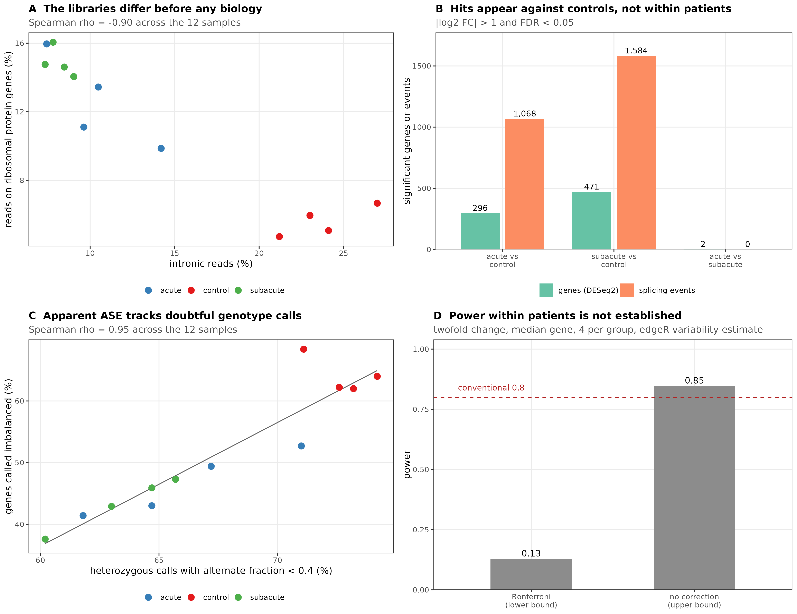
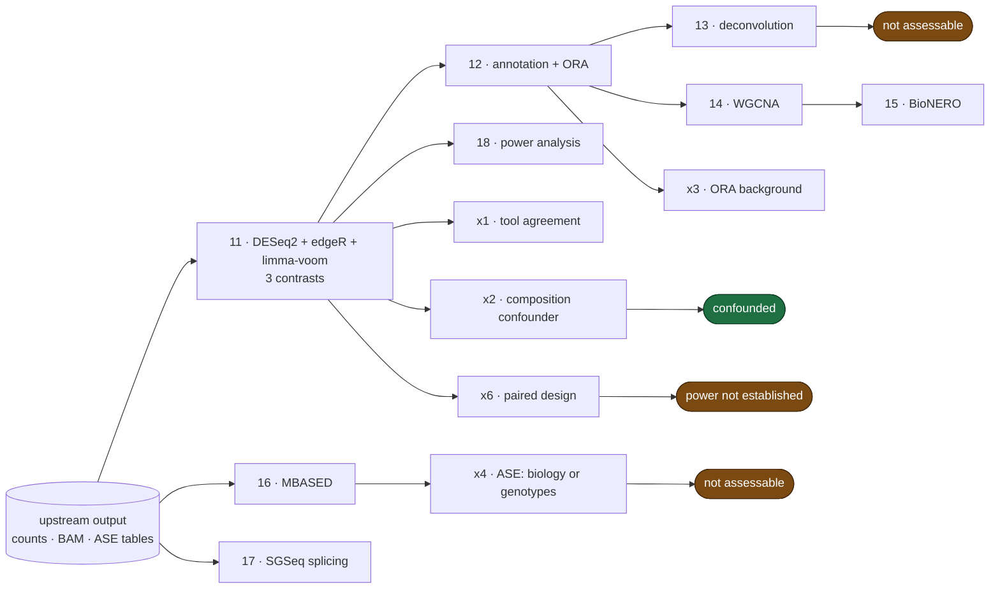
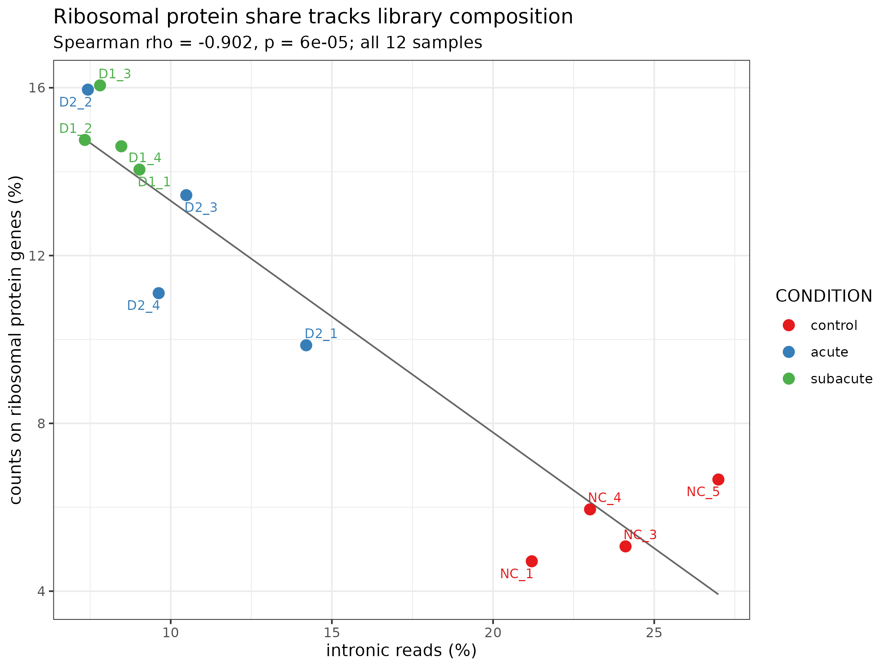
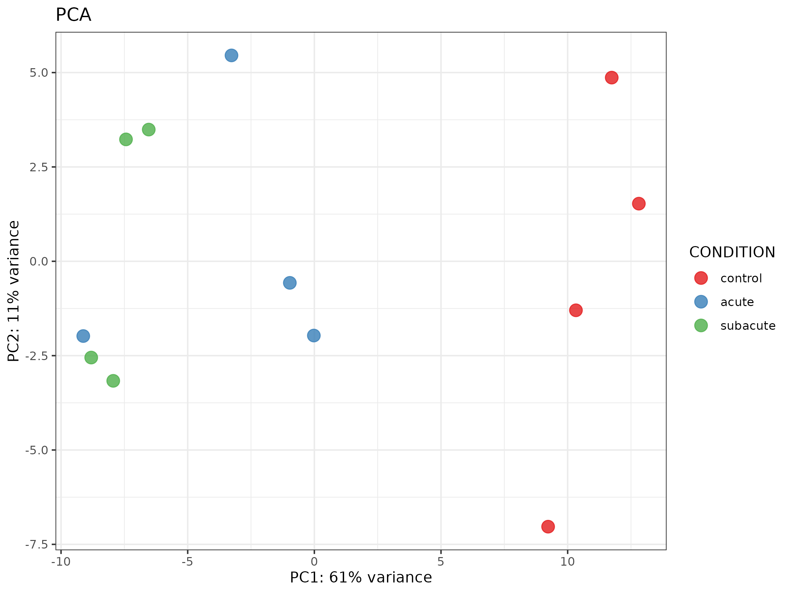
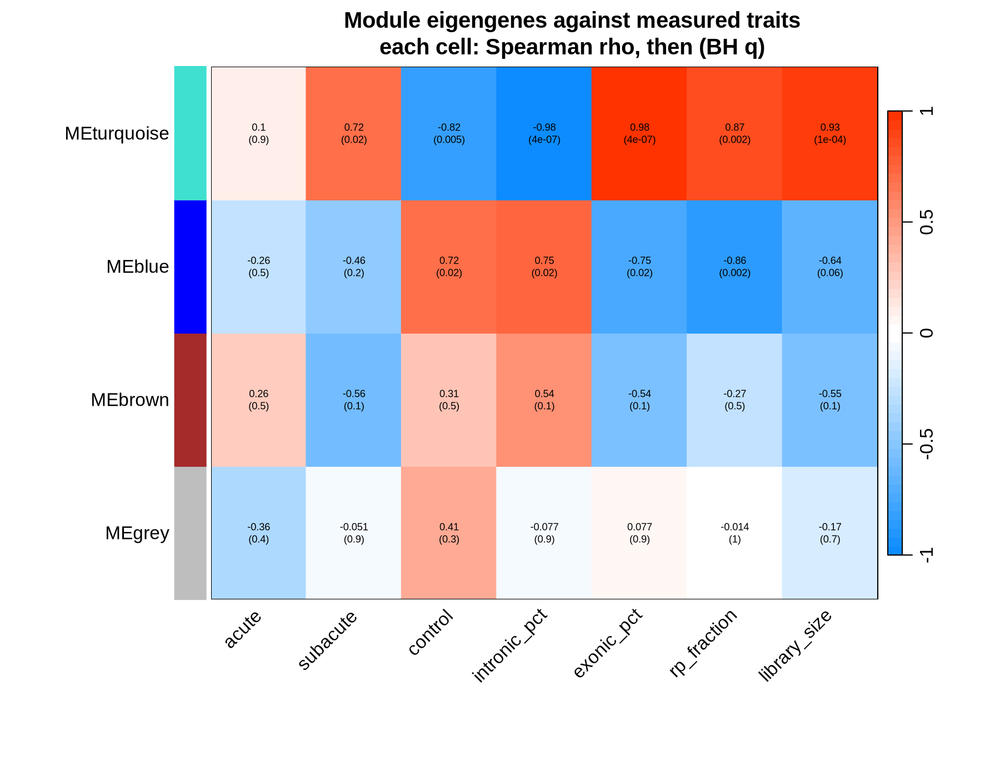
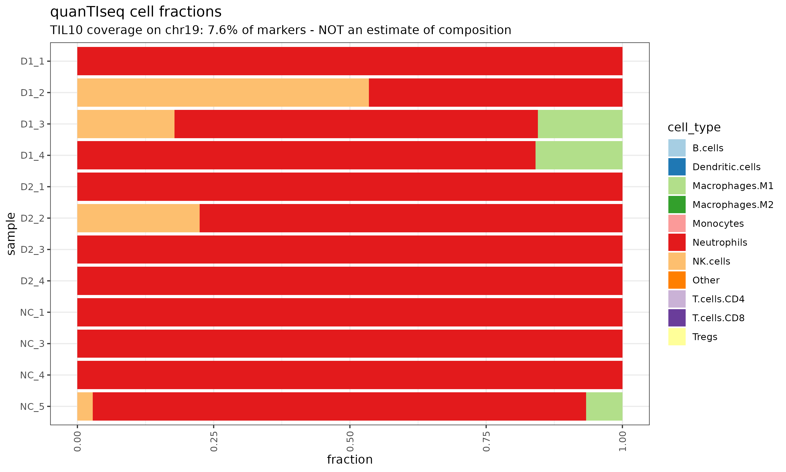
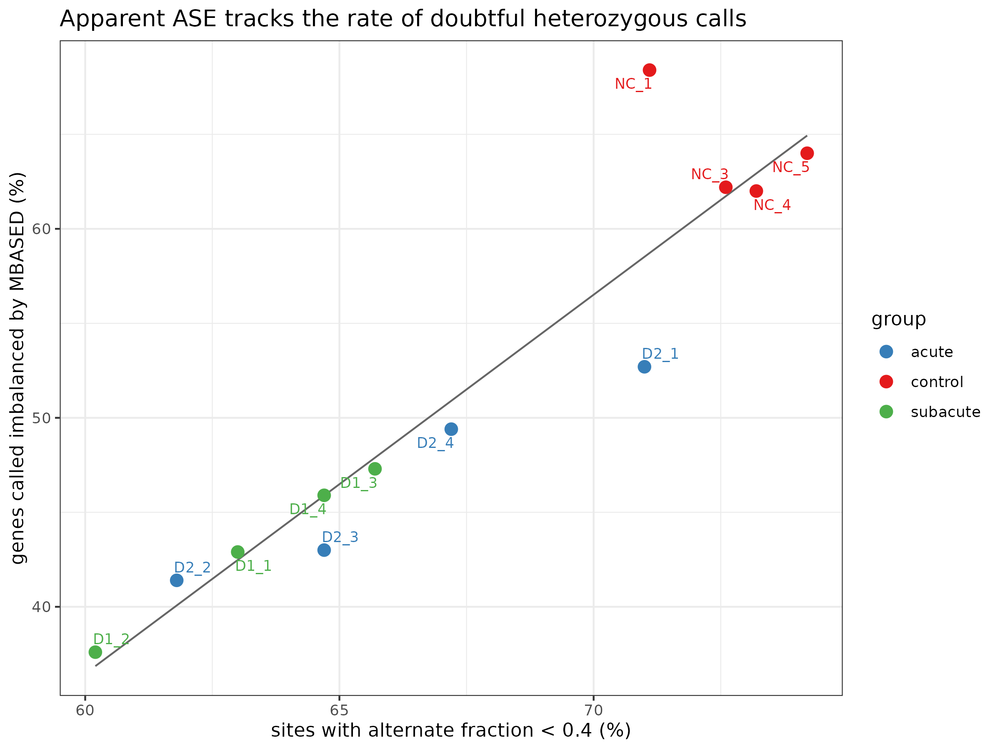
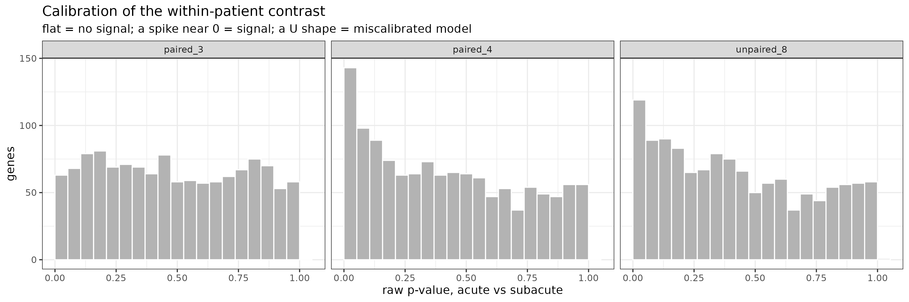
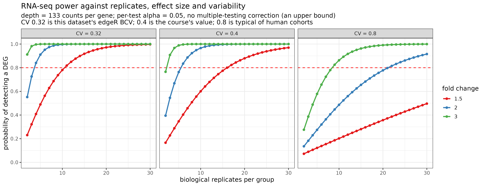

# Downstream RNA-seq analysis on chromosome 19 — ischemic stroke PBMC


Differential expression, enrichment, cell-type deconvolution, co-expression
networks, allele-specific expression, alternative splicing and power analysis,
run on twelve public human PBMC RNA-seq libraries (*Homo sapiens*) restricted to
chromosome 19. It continues
[RNA-seq-Best-Practice](https://github.com/koncevojdanila10-source/RNA-seq-Best-Practice),
which does the alignment, counting and variant calling; this repository starts
from that output.



*A: the libraries differ before any biology. B: hits appear against the controls,
not within patients. C: apparent allele-specific expression tracks doubtful genotype calls. D: power for
the within-patient contrast is not established. Drawn from the tables by `R/98_overview_figure.R`.*

### In short

| question | answer |
|---|---|
| Can the patient-versus-control comparison be read? | No: it is library composition (R² = 0.93), and the same axis shows up in every method |
| Does the network layer agree? | Yes, on the axis: the main module tracks intronic fraction (rho = −0.979); module membership is unstable |
| Can cells be deconvolved on chr19? | No: 13 of the 170 marker genes are present (7.65%) |
| Is allele-specific expression assessable? | No: 54% of genes are flagged and the rate follows genotype quality (rho = 0.949) |
| Does the within-patient contrast show anything? | No gene at FDR < 0.05, and its power is not established (0.13 to 0.85) |

## Key findings

Most of what this analysis found is a limit on what these data can say. Each
statement below is backed by a table in [`SUMMARY.md`](SUMMARY.md), which is
generated from the pipeline's output and not typed in.

1. **The patient-versus-control comparison cannot be interpreted.** The two
   groups differ in how the libraries were made, and that difference alone
   produces a strong, convincing "signal".
   - Intronic read fraction separates the groups completely: 7.3–14.2% in
     patients, 21.2–27.0% in controls, R² = 0.93.
   - Eleven of the twelve ribosomal protein genes are among the differentially
     expressed genes in each patient-versus-control contrast (odds ratio 38.3
     and 19.6), and the enriched terms are translation, ribosome and rRNA
     processing.
   - The ribosomal share of reads follows the intronic fraction *within the
     patients alone* (Spearman rho = −0.881, n = 8), where group membership
     cannot explain it. This is a technical gradient.
   - Putting the intronic fraction into the model removes almost everything
     (296 → 4 and 471 → 5 genes). Because the covariate is 93% explained by
     group, this shows the two cannot be separated in this design, not that the
     biology was refuted.
2. **The same signal appears in every other method.** The largest co-expression
   module correlates with intronic fraction at rho = −0.979 (BioNERO, an
   independent implementation: −0.937). There are 1,068 and 1,584 differentially
   spliced events against controls, and the number of events detected per sample
   follows the intronic fraction (rho = 0.769).
3. **Cell-type deconvolution is not assessable here.** 13 of the 170 marker genes
   of the quanTIseq TIL10 signature lie on chromosome 19 (7.65%). The method
   reports a mean of 88.8% neutrophils for samples of peripheral blood
   *mononuclear* cells, from which neutrophils are removed by the preparation.
4. **Allele-specific expression is not assessable here.** MBASED calls 54% of
   genes imbalanced, against low single digits for real ASE. The per-sample rate
   follows the share of doubtful heterozygous calls (rho = 0.949), and the genes
   it flags are those with a nearly absent allele (median lowest alternate
   fraction 0.077 against 0.429). The genotypes come from the same reads, so the
   analysis is circular; this reproduces, with a second method, the verdict of
   the upstream repository.
5. **The one contrast not confounded by group, acute against subacute, returns
   nothing, and the experiment could not have shown more.** No gene passes
   FDR < 0.05 in any of three models (smallest adjusted p 0.105, 0.194, 0.902),
   and the 2 genes the three-group model reported do not hold up in the
   eight-patient fit. Power for a twofold change at the median gene is 0.13 to
   0.85 depending on how multiple testing is counted (edgeR's variability
   estimate), and 0.11 to 0.94 in the paired-design fits, so it is **not
   established**. Composition still differs inside the pairs (the acute sample
   has the higher intronic fraction in 4 of 4), and one pair, P3, is flagged
   by genotype concordance as possibly two different people (0.7345).
6. **Method choices that did not matter, tested.** DESeq2, edgeR and limma-voom
   agree on fold changes (Spearman 0.96–1.00). Using chromosome 19 rather than
   the whole genome as the enrichment background changed few terms and produced
   no false enrichment in eight random gene sets, a test that can only exclude a
   strong effect.

What this does **not** show: that stroke has no transcriptional signature in
blood. These data cannot tell either way.

## Contents

- [Key findings](#key-findings)
- [Scope and what the data are](#scope-and-what-the-data-are)
- [Pipeline](#pipeline)
- [Results](#results)
- [Requirements](#requirements)
- [Data](#data)
- [Usage](#usage)
- [Repository structure](#repository-structure)
- [Known issues handled in the scripts](#known-issues-handled-in-the-scripts)
- [Documentation](#documentation)
- [License](#license)
- [Source](#source)

## Scope and what the data are

Twelve PBMC libraries from BioProject
[PRJNA506047](https://www.ncbi.nlm.nih.gov/bioproject/PRJNA506047) (Zhu et al.
2019, *Frontiers in Neurology* 10:36): four patients with ischemic stroke sampled
at 24 hours (`acute`) and again at day 7 (`subacute`), and four healthy donors
(`control`).

Four things limit every result, and they are stated here because they are
easy to lose further down:

- **Chromosome 19 only.** The upstream pipeline aligns against chr19 to fit in
  16 GB of RAM. This is why the TIL10 signature is 7.65% present and why the
  allele-specific analysis has between 800 and 7,000 sites per sample.
- **Twelve samples**, four per group. Correlation-based methods such as WGCNA
  are normally run on twenty or more.
- **Reads were downsampled** upstream to the first 20 million spots per run and
  prefiltered against chr19 exons, so the other chromosomes cannot be recovered
  from these files.
- **The library-preparation difference between groups** described above. It is
  a property of the published dataset, not of this analysis.

## Pipeline



| step | script | what it does |
|---|---|---|
| 11 | [`11_de_three_tools.R`](R/11_de_three_tools.R) | DESeq2, edgeR and limma-voom on all three pairwise contrasts; normalisation comparison, PCA, volcano, Venn diagrams |
| 12 | [`12_annotate_ora.R`](R/12_annotate_ora.R) | Gene symbols and biotypes from biomaRt; over-representation analysis against the genes tested |
| 13 | [`13_deconvolution.R`](R/13_deconvolution.R) | quanTIseq, preceded by a measurement of how much of the signature exists on chr19 |
| 14 | [`14_wgcna.R`](R/14_wgcna.R) | WGCNA with the soft threshold read off this data, modules against measured library traits |
| 15 | [`15_bionero.R`](R/15_bionero.R) | BioNERO network, all network types tried, partition compared with WGCNA by adjusted Rand index |
| 16 | [`16_ase_mbased.R`](R/16_ase_mbased.R), [`16b_ase_figures.R`](R/16b_ase_figures.R) | MBASED on all twelve samples; figures drawn separately from the saved tables |
| 17 | [`17_splicing_sgseq.R`](R/17_splicing_sgseq.R) | SGSeq splice events and limma-voom differential splicing |
| 18 | [`18_power_analysis.R`](R/18_power_analysis.R) | Power at the variability measured in these counts, bracketed by the multiple-testing assumption |
| x1 | [`x1_de_concordance.R`](analyses/x1_de_concordance.R) | Formal agreement between the three DE tools |
| x2 | [`x2_confounder.R`](analyses/x2_confounder.R) | Tests whether the group signal is library composition |
| x3 | [`x3_ora_background.R`](analyses/x3_ora_background.R) | The same lists against two backgrounds, plus random gene sets |
| x4 | [`x4_ase_crosscheck.R`](analyses/x4_ase_crosscheck.R) | Whether the ASE signal follows the genotype calls |
| x6 | [`x6_paired_design.R`](analyses/x6_paired_design.R) | Within-patient contrast with the pairing modelled, with and without pair P3 |
| 98 | [`98_overview_figure.R`](R/98_overview_figure.R) | The four-panel overview figure, drawn from the tables |
| 99 | [`99_summarize_results.R`](R/99_summarize_results.R) | Builds `SUMMARY.md` and fills `showcase/` |
| 99b | [`99b_check_readme.R`](R/99b_check_readme.R) | Recomputes every figure this README quotes from the tables and reports any that no longer match |

## Results

Every table is in **[`SUMMARY.md`](SUMMARY.md)**; the figures below are copies
from **[`showcase/`](showcase/)**.

### The groups differ before any biology



*Share of reads on the 12 ribosomal protein genes against the intronic fraction
of the library. The line is fitted to all twelve samples; the share also falls
with intronic fraction among the eight patients alone (rho = −0.88).*



*The first principal component, 61% of the variance, separates controls from
patients. Given the composition differences above it cannot be read as a stroke
signal.*

### The same axis reappears in the networks



*WGCNA module eigengenes against measured traits. The turquoise module (701 of
the 1,109 genes) tracks intronic fraction at rho = −0.98. Module boundaries are
unstable (adjusted Rand index 0.27 against BioNERO at identical settings, 0.09
at each package's defaults); the association with composition is not.*

### Two analyses the data cannot support



*quanTIseq on 13 of 170 signature genes. Almost every sample is called
neutrophils, in a preparation that contains none by design. Shown as evidence of
the limit, not as a composition estimate.*



*The share of genes MBASED calls imbalanced, per sample, against the share of
heterozygous calls whose alternate fraction is below 0.4.*

### The one contrast that is not confounded by group



*Raw p-values for acute against subacute in three models. None has a gene at
FDR < 0.05. The two models that include pair P3 show an excess of small
p-values (9–11% below 0.05) that disappears without it (4.5%), but dropping a
pair also removes power, so the two explanations cannot be told apart.*



*Power against replicates. These curves use a per-test alpha of 0.05 with no
correction for the number of genes tested, so they are an upper bound. With a
Bonferroni correction, power for a twofold change at the median gene with four
replicates falls from 0.85 to 0.13.*

## Requirements

- Linux or WSL2 (developed on Ubuntu 22.04 under WSL2, 8 cores, 27 GB RAM)
- conda or mamba
- The output of the upstream pipeline for the same twelve samples (see
  [Usage](#usage))
- A working internet connection: Ensembl (biomaRt) and WebGestalt are queried
  remotely, so enrichment results can shift as those databases are updated
- About 2–3 hours for a first complete run, almost all of it in two steps
  (SGSeq ~70 minutes, MBASED ~30 minutes); cached on later runs

Package versions actually installed are recorded in
[`envs/versions_installed.txt`](envs/versions_installed.txt) — R 4.5.3 and
Bioconductor 3.22.

## Data

BioProject **PRJNA506047**, twelve runs listed in [`samples.tsv`](samples.tsv).
The reads are never committed and are not needed here: this repository consumes
the count files, alignments and allele-count tables produced by the upstream
repository, which downloads and processes them.

[`inputs/`](inputs/) holds two small tables from the upstream pipeline that the
analyses use and do not recompute: the read distribution per sample and the
pairwise genotype concordance.

## Usage

```bash
git clone https://github.com/koncevojdanila10-source/RNA-seq-Best-Practice.git
git clone https://github.com/koncevojdanila10-source/RNA-seq-Best-Practice-R.git
```

Run the upstream pipeline first; it writes to `~/rna_work`. If it lives
elsewhere, point this project at it:

```bash
export RNA_UPSTREAM_DIR=/path/to/rna_work
```

Then everything, in order:

```bash
cd RNA-seq-Best-Practice-R
bash run_all.sh
```

`run_all.sh` checks that the upstream output exists, creates the conda
environment if needed, runs every step and ends with `SUMMARY.md`. An
interrupted run resumes with `bash run_all.sh --from 14`. Single steps:

```bash
bash run_step.sh --list      # what is available
bash run_step.sh 11          # differential expression
bash run_step.sh x2          # the confounder analysis
bash summarize_results.sh    # regenerate SUMMARY.md and showcase/
bash run_step.sh 99b         # check that README.md still matches the tables
```

Heavy outputs go to `~/rna_work_r` (override with `RNA_WORK_DIR`) and are not
committed.

## Repository structure

```
config.sh                 paths and resources — one source of truth
samples.tsv               sample sheet: sample, SRA run, group, patient, stage
setup_env.sh              conda environment and version manifest
run_all.sh                every step in order, resumable
run_step.sh               one step inside the environment
summarize_results.sh      regenerates SUMMARY.md and showcase/
SUMMARY.md                every metric, generated by code
R/                        pipeline steps 11-18 and the summary builder
analyses/                 cross-checks and tests of the main findings (x1-x6)
inputs/                   two small tables taken from the upstream pipeline
envs/                     installed package versions and a pinned environment (rna_r.yml)
showcase/                 figures and tables that show the pipeline ran
logs/                     one log per step
```

## Known issues handled in the scripts

Each cost time to find and is fixed or flagged in code:

- **A zero p-value is not zero.** MBASED estimates p by simulation and reports 0
  below `1/numSim`. Plotting `-log10` of the smallest floating-point number put
  most genes on a line at 308; the figures now floor at the simulation's
  resolution and say how many genes sit on it.
- **An error is not an empty result.** A failed enrichment query is recorded as
  `NA`, never as zero, because a missing `zip` once made ten runs look like
  negative findings.
- **Conda's R leaves `R_ZIPCMD` empty**, so `utils::zip()` fails even when `zip`
  is installed. The script sets it.
- **WGCNA and DESeq2 both define `cor()`.** `blockwiseModules` fails with
  "unused arguments" unless WGCNA's version is bound for the network build.
- **SGSeq in annotation mode finds no novel events.** Passing the annotation to
  `analyzeFeatures` quantifies it and predicts nothing new, so a novel-feature
  test run that way is void rather than negative.
- **Spearman's exact p-value underflows to 0** for strong correlations on small
  samples; the helper falls back to the asymptotic approximation and says so.
- **`plotFeatures` in current SGSeq is broken.** The patched function from the
  course is included, marked as course material.

## Documentation

- **[`SUMMARY.md`](SUMMARY.md)** — every metric, generated by code.
- **[`EXPLANATION.md`](EXPLANATION.md)** — what each script does and why, command
  by command.
- **[`showcase/`](showcase/)** — the figures and tables behind each finding.
- **[`logs/`](logs/)** — one log per step, committed on purpose.

## License

MIT — see [`LICENSE`](LICENSE). Citation metadata is in [`CITATION.cff`](CITATION.cff). The sequencing data are public and belong to
their original authors; cite Zhu et al. 2019 if you use them.
[`R/plotFeatures_fixed.R`](R/plotFeatures_fixed.R) is course material, derived
from SGSeq (Artistic-2.0), and is not the work of this repository's author.

## Source

Course project — Blastim RNA-seq course, lectures 19–21 (differential
expression and annotation, cell deconvolution and co-expression networks,
experimental design and alternative splicing; lecturer Alexey Zarubin).

The lectures demonstrated these methods on a different dataset, skeletal muscle
biopsies from type 2 diabetic, obese and active people (PRJNA804557), with four
samples. This repository applies the same methods to the stroke PBMC dataset
from the first week of the course and makes no claim to reproduce the lecture
results. Where the course scripts and the data disagreed, the deviation is
documented in the script that makes it.
